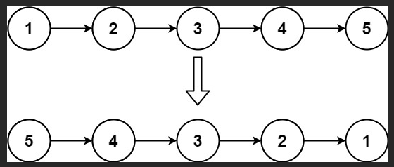
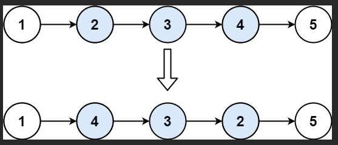

##第206题反转链表

反转整条链表比较简单
1.建立一个空指针pre接收反转的链表
2.利用cur指针遍历整个链表
3.将cur->next用指针nxt保存起来(因为cur要反转，改变指针的指向，所以要提前保存起来)
4.将cur->next指向pre(接到反转的链表头部)
5.让pre指向反转链表的头部，即pre = cur
6.cur继续遍历，即cur = nxt
7.往复循环，直到cur为空
##Code
```cpp
class Solution {
public:
    ListNode* reverseList(ListNode* head) {
        ListNode* pre = nullptr;
        ListNode* cur = head;
        ListNode* nxt = nullptr;
        while (cur) {
            nxt = cur->next;
            cur->next = pre;
            pre = cur;
            cur = nxt;
        }
        return pre;
    }
};
```
##第92题反转链表 II

对于区间反转链表，相较于反转整条链表有几点不同
1.要找开始反转节点的前一个结点p0(方便将反转的部分链表接回到原链表中)
2.为了应对开始反转的节点是头节点的情况，在链表头部添加一个虚拟头节点dummy
3.利用while循环找到p0
4.开始反转，循环 right - left + 1次
5.将反转的部分链表接回到原来的链表(p0->next->next = cur; p0->next = pre)
##Code
```cpp
class Solution {
public:
    ListNode* reverseBetween(ListNode* head, int left, int right) {
        ListNode* dummy = new ListNode(0, head);
        ListNode* p0 = dummy;
        for (int i = 0; i < left - 1; i++) p0 = p0->next;
        ListNode* pre = nullptr;
        ListNode* cur = p0->next;
        ListNode* nxt = nullptr;
        for (int i = 0; i <= right - left; i++) {
            nxt = cur->next;
            cur->next = pre;
            pre = cur;
            cur = nxt;
        }
        p0->next->next = cur;
        p0->next = pre;
        return dummy->next;
    }
};
```